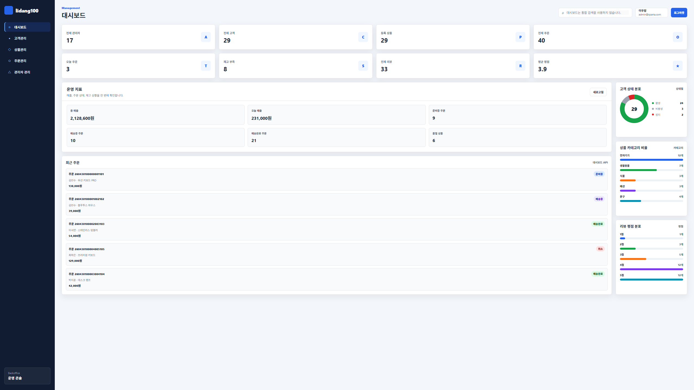
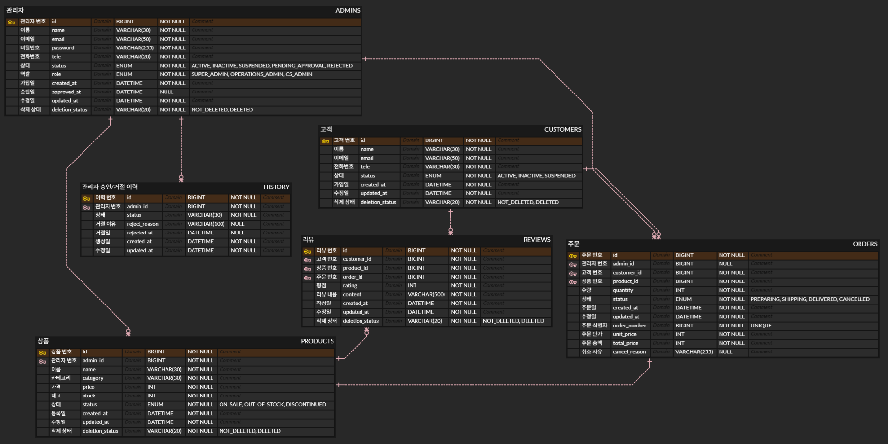

# 일당백 Backoffice

관리자용 백오피스 API 서버입니다.  
관리자 인증/인가, 고객 관리, 상품 관리, 주문 관리, 리뷰 관리, 대시보드 조회 기능을 제공합니다.

## 프로젝트 소개

`ildang100-backoffice`는 쇼핑몰 운영자가 내부 데이터를 관리하기 위한 백오피스 서버입니다.

Spring Boot 기반의 3 Layer Architecture로 구성되어 있으며, JWT 인증 방식을 사용해 Stateless한 API 인증 구조를 제공합니다.

## 시연 영상

시연 영상은 추후 추가할 예정입니다.



## 주요 기능

- 관리자 회원가입 / 로그인 / 로그아웃
- JWT 기반 인증 및 Spring Security 기반 인가
- 관리자 계정 관리
- 고객 조회 / 수정 / 상태 변경 / 삭제
- 상품 등록 / 수정 / 재고 변경 / 상태 변경 / 삭제
- 주문 조회 / 생성 / 상태 변경 / 주문 취소
- 리뷰 조회 / 상세 조회 / 삭제
- 대시보드 통계 조회
- Soft Delete 기반 데이터 관리

## 기술 스택

| 구분 | 기술 |
| --- | --- |
| Language | Java 21 |
| Framework | Spring Boot 4.0.6 |
| Build Tool | Gradle |
| Database | MySQL |
| ORM | Spring Data JPA, Hibernate |
| Security | Spring Security, JWT |
| Validation | Spring Validation |
| Library | Lombok, JJWT |
| Docs | API 명세서, ERD |

## 프로젝트 구조

```text
src/main/java/com/ildang100/backoffice
├── admin        # 관리자 관리
├── auth         # 로그인, 회원가입, JWT 인증
├── common       # 공통 응답, 예외, Enum, BaseEntity
├── config       # Spring Security 설정
├── customer     # 고객 관리
├── dashboard    # 대시보드 통계 조회
├── order        # 주문 관리
├── product      # 상품 관리
└── review       # 리뷰 관리
```

## 팀원 역할

| 이름 | 역할 |
| --- | --- |
| 이우람 | 인증/인가, JWT, 대시보드, 백오피스 API 개발 |
| 박채빈 | 관리자 백오피스 API 개발 |
| 임지호 | 고객·주문 백오피스 API 개발 |
| 김준성 | 상품·리뷰 백오피스 API 개발 |

## 아키텍처

본 프로젝트는 3 Layer Architecture를 기준으로 구성되어 있습니다.

```text
Controller → Service → Repository → Database
```

- Controller: 요청과 응답 처리
- Service: 비즈니스 로직 처리
- Repository: 데이터 조회 및 저장
- Entity: DB 테이블과 매핑되는 도메인 객체
- DTO: API 요청/응답 데이터 전달 객체

## 인증 / 인가

본 프로젝트는 JWT 기반 인증 방식을 사용합니다.

로그인 성공 시 Access Token을 발급하고, 이후 보호된 API 요청에서는 아래와 같이 토큰을 전달해야 합니다.

```http
Authorization: Bearer {accessToken}
```

### 권한 정책

| 권한 | 설명 |
| --- | --- |
| SUPER_ADMIN | 전체 관리자 권한 |
| OPERATIONS_ADMIN | 운영 관리자 권한 |
| CS_ADMIN | 고객 응대 관리자 권한 |

Spring Security 설정을 통해 URL과 HTTP Method 기준으로 접근 권한을 제어합니다.

## 주요 API

| 기능 | Method | URL | 인증 |
| --- | --- | --- | --- |
| 관리자 회원가입 | POST | `/admins/signup` | 불필요 |
| 관리자 로그인 | POST | `/admins/login` | 불필요 |
| 관리자 로그아웃 | POST | `/admins/logout` | 필요 |
| 내 프로필 조회 | GET | `/admins/me` | 필요 |
| 내 프로필 수정 | PUT | `/admins/me` | 필요 |
| 비밀번호 변경 | PATCH | `/admins/me/password` | 필요 |
| 관리자 목록 조회 | GET | `/admins` | 필요 |
| 고객 목록 조회 | GET | `/admin/customers` | 필요 |
| 상품 목록 조회 | GET | `/admin/products` | 필요 |
| 주문 목록 조회 | GET | `/admin/orders` | 필요 |
| 리뷰 목록 조회 | GET | `/admin/products/{productId}/reviews` | 필요 |
| 대시보드 조회 | GET | `/admin/dashboard` | 필요 |

자세한 API 명세는 [API 명세서](docs/api-spec.md)를 참고합니다.

## ERD



## 실행 방법

### 1. 프로젝트 클론

```bash
git clone {repository-url}
cd ildang100-backoffice
```

### 2. 환경 변수 설정

`application.properties`에서 아래 환경 변수를 사용합니다.

```properties
URL=jdbc:mysql://localhost:3306/backoffice_db
USERNAME=your_mysql_username
PASSWORD=your_mysql_password
JWT_SECRET=your_jwt_secret_key
```

JWT Secret은 충분히 긴 문자열을 사용하는 것을 권장합니다.

### 3. 데이터베이스 생성

```sql
CREATE DATABASE backoffice_db;
```

### 4. 서버 실행

Windows 기준:

```bash
.\gradlew.bat bootRun
```

Mac / Linux 기준:

```bash
./gradlew bootRun
```

## DB 초기화

프로젝트 실행 시 아래 파일을 통해 DB 스키마와 초기 데이터가 반영됩니다.

```text
src/main/resources/schema.sql
src/main/resources/data.sql
```

`spring.sql.init.mode=always` 설정으로 인해 실행 시 SQL 초기화가 수행됩니다.

## 공통 응답 구조

API 응답은 공통 응답 객체를 사용합니다.

```json
{
  "status": 200,
  "message": "요청이 성공했습니다.",
  "data": {}
}
```

## 예외 처리

프로젝트 전역 예외 처리는 `GlobalExceptionHandler`에서 담당합니다.

주요 예외 상황은 다음과 같습니다.

- 요청값 검증 실패
- 인증 실패
- 권한 부족
- 리소스 없음
- 중복 데이터
- 서버 내부 오류

## 브랜치 전략

```text
main      # 배포 브랜치
develop   # 개발 통합 브랜치
feature/* # 기능 개발 브랜치
fix/*     # 버그 수정 브랜치
refactor/*# 리팩토링 브랜치
```

## 커밋 컨벤션

```text
feat: 새로운 기능 추가
fix: 버그 수정
refactor: 코드 리팩토링
docs: 문서 수정
test: 테스트 코드 추가 또는 수정
chore: 설정 및 기타 작업
```
